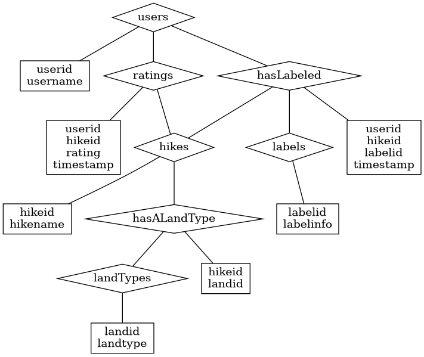

# Hikes database

The hike database contains `hikes` that have 2 attributes: a `hikeid` and a `name`.
A `hike` can have multiple `land types` (cascades, forest, meadow...). 
A `hike` doesn't need to have a `land type`.

A `user` can give one (and one only) rate to a `hike`. 
This `rating` can be a value between 0 and 5 stars, without decimals.

A `user` can also `label` a hike on a specific date that the system offers (e.g. "very cool", "amazing", "breath taking"...). 
He can label the same hike many times, at different moments.

## Specifications

Here is the entity-relation model that needs to be implemented:

## Tables and attributes

You need to respect certain constraint on the data. 
Here are constraints on types for each tables:
- `users`: userid (int) [PK], username (text)
- `hikes`: hikeid (int) [PK], hikename (text) 
- `ratings`: userid (int) [FK], hikeid (int) [FK], rating (int [0-5]), timestamp (bigint)
- `landtypes`: landid (int) [PK], landtype (text)
- `label`: labelid (int) [PK], labelinfo (text)
- `hasalandtype`: hikeid (int)[FK], landid [FK]
- `haslabeled`: userid (int) [FK], hikeid(int)[FK], labelid (int) [FK], timestamp (bigint)

[PK] stands for Primary Key
[FK] stands for Foreign Key

